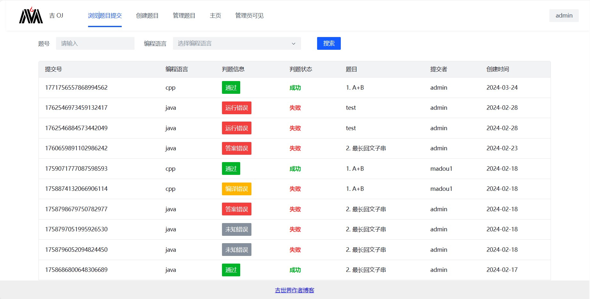

# 前言
***
开源地址

[前端代码](https://github.com/MA-douzhang/geoj-frontend)

[后端代码](https://github.com/MA-douzhang/geoj-backend)

该项目有完整论文，如有需要请添加WX号：wozuisuainizuichou
***
当前是吉OJ-Cloud项目的后端源码，该项目是ACM答题方式，前端模仿Leetcode样式的在线判题平台。

后端功能主要分为，三个服务模块，gebi-user（用户服务），gebi-judge（判题服务），gebi-question（题目服务）。

框架中整合了RabbitMQ + AI + Redis 作为公共模块

### 描述
设计的平台是为了使用户练习算法题，用户可以快速的提高算法能力与了解自己的算法学习方向，达到可以快速提高算法能力并了解自己算法学习方向的目的平台应用采用ACM的刷题模式，利用AI分析用户提交的代码，并分析出用户代码中的不足点，给出优化代码。代码在线测评使用Docker虚拟化技术实现，防止注入木马程序，恶意代码破坏运行环境，保证代码运行的安全性，在线测评平台针对不同的用户提供高质量个性化学习服务。
## 项目展示

## 技术栈
***
框架：Spring Cloud

数据库：MySQL

网关：Spring Cloud Gateway

中间件：Redis + RabbitMq

注册中心：Nacos

RPC框架：OpenFeign

插件：Mybatis(Plus)，Swagger（接口文档）

# 服务器部署
1. 使用服务器配置为2核4G
2. 宝塔面板
3. 详细步骤和思路笔记在[语雀笔记](https://www.yuque.com/aipupu-ydbvq/odwi00/oqextwg2bkfrtag2)

## 说明
***
>如果对您有帮助，您可以右上角点一个“start”支持一下，👍
>
> 如有问题请直接在 Issues 中提，或者您发现问题并有非常好的解决方案，欢迎 PR 👍

# 效果展示
***
[查看在线展示](http://8.130.16.185:7075/)

## 功能
***
+ [x] 登录注册功能
+ [X] 分布式用户验证
+ [X] 网关鉴权
+ [x] 消息队列保证服务的健壮性
+ [x] 支付模块
+ [x] 支持Java语言和C语言判题
+ [x] AI辅助答题

## 展示

